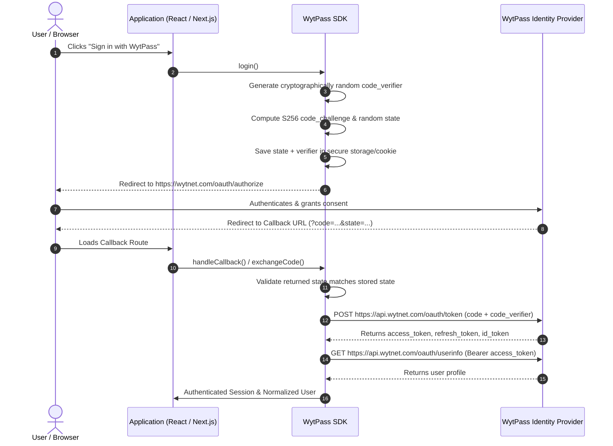

# WytPass SDK

> Enterprise-grade TypeScript SDK for **WytPass SSO / OAuth 2.0 / OpenID Connect Identity Provider**.

[](https://www.npmjs.com/package/@wytpass/core)
[](https://opensource.org/licenses/MIT)
[](https://www.typescriptlang.org/)

---

## Table of Contents

- [Overview](#overview)
- [Monorepo Packages](#monorepo-packages)
- [OAuth 2.0 PKCE Flow](#oauth-20-pkce-flow)
- [Quick Start: React](#quick-start-react)
- [Quick Start: Next.js (App Router)](#quick-start-nextjs-app-router)
- [Quick Start: Node.js / Vanilla TypeScript](#quick-start-nodejs--vanilla-typescript)
- [Configuration Reference](#configuration-reference)
- [Environment Variables](#environment-variables)
- [NextAuth.js / Auth.js Integration](#nextauthjs--authjs-integration)
- [Security & Best Practices](#security--best-practices)
- [Local Development vs Production](#local-development-vs-production)
- [Troubleshooting & FAQ](#troubleshooting--faq)
- [License](#license)

---

## Overview

**WytPass** is an OAuth 2.0 and OpenID Connect (OIDC) identity provider by Wytnet. This SDK eliminates the boilerplate and complexity of manually implementing:
- Proof Key for Code Exchange (**RFC 7636 PKCE**) using SHA-256 (`S256`).
- Cryptographic anti-CSRF `state` generation and constant-time validation.
- Form-urlencoded token exchange and refresh requests.
- User profile fetching and schema normalization.
- OIDC Discovery (`.well-known/openid-configuration`) and JWKS caching.
- Safe, non-leaking error handling and sanitized logging.

---

## Monorepo Packages

| Package | Version | Description |
| :--- | :--- | :--- |
| [`@wytpass/core`](file:///e:/D%20drive/Projects/Wytnet/npm-package/packages/core) | `0.1.0` | Framework-agnostic OAuth/OIDC client, PKCE, state protection, token exchange, and UserInfo. |
| [`@wytpass/react`](file:///e:/D%20drive/Projects/Wytnet/npm-package/packages/react) | `0.1.0` | React context provider, `useWytPass()` hook, and `<WytPassCallback />` component. |
| [`@wytpass/nextjs`](file:///e:/D%20drive/Projects/Wytnet/npm-package/packages/nextjs) | `0.1.0` | Next.js App Router helpers, HttpOnly cookie sessions, route handlers, and NextAuth provider. |

---

## OAuth 2.0 PKCE Flow



---

## Quick Start: React

### 1. Installation

```bash
npm install @wytpass/react @wytpass/core
```

### 2. Wrap Application with `<WytPassProvider />`

```tsx
import React from 'react';
import ReactDOM from 'react-dom/client';
import { WytPassProvider } from '@wytpass/react';
import App from './App';

ReactDOM.createRoot(document.getElementById('root')!).render(
  <React.StrictMode>
    {/* Zero Configuration: Only clientId is required! */}
    <WytPassProvider clientId="your_client_id">
      <App />
    </WytPassProvider>
  </React.StrictMode>
);
```

### 3. Use in React Components

```tsx
import { useWytPass } from '@wytpass/react';

export function Header() {
  const { isAuthenticated, isLoading, user, login, logout } = useWytPass();

  if (isLoading) return <div>Checking authentication...</div>;

  if (!isAuthenticated) {
    return <button onClick={() => login()}>Sign in with WytPass</button>;
  }

  return (
    <div>
      
      <span>Welcome, {user?.name}!</span>
      <button onClick={() => logout()}>Sign Out</button>
    </div>
  );
}
```

### 4. Create Callback Route

```tsx
import { WytPassCallback } from '@wytpass/react';

export function CallbackPage() {
  return (
    <WytPassCallback
      successRedirect="/"
      errorRedirect="/login"
      onError={(error) => console.error('Authentication error:', error)}
    />
  );
}
```

---

## Quick Start: Next.js (App Router)

### 1. Installation

```bash
npm install @wytpass/nextjs @wytpass/core
```

### 2. Configure Environment (`.env.local`)

```env
WYTPASS_CLIENT_ID=your_client_id_here
WYTPASS_CLIENT_SECRET=your_client_secret_here
WYTPASS_REDIRECT_URI=http://localhost:3000/api/auth/wytpass/callback
```

### 3. Add Route Handlers

- **`app/api/auth/wytpass/login/route.ts`**:
  ```ts
  import { handleWytPassLogin } from '@wytpass/nextjs';
  export const GET = handleWytPassLogin();
  ```

- **`app/api/auth/wytpass/callback/route.ts`**:
  ```ts
  import { handleWytPassCallback } from '@wytpass/nextjs';
  export const GET = handleWytPassCallback(undefined, '/dashboard');
  ```

- **`app/api/auth/wytpass/logout/route.ts`**:
  ```ts
  import { handleWytPassLogout } from '@wytpass/nextjs';
  export const GET = handleWytPassLogout();
  ```

### 4. Protect Server Components

```tsx
// app/dashboard/page.tsx
import { createWytPassAuth } from '@wytpass/nextjs';
import { redirect } from 'next/navigation';

export default async function DashboardPage() {
  const auth = createWytPassAuth();
  const session = await auth.getSession();

  if (!session) {
    redirect('/api/auth/wytpass/login');
  }

  return (
    <main>
      <h1>Hello, {session.user.name}</h1>
      <p>Email: {session.user.email}</p>
      <a href="/api/auth/wytpass/logout">Sign Out</a>
    </main>
  );
}
```

---

## Quick Start: Browser / Vanilla TypeScript / Node.js

```typescript
import { WytPass } from '@wytpass/core';

// 1. Initialize client (Zero configuration: only clientId is required!)
const wytpass = new WytPass({
  clientId: 'wp_your_client_id_here'
});

// 2. Initiate Login (Automatically redirects in browser with PKCE & CSRF protection)
await wytpass.login();

// 3. Handle Callback (On callback: validates state, exchanges code, retrieves user)
const { user, tokens } = await wytpass.handleCallback();
console.log('Authenticated User:', user.name, user.email, tokens.access_token);

// 4. Session management helpers
const accessToken = await wytpass.getAccessToken();
const currentUser = await wytpass.getUser();
const isAuthed = await wytpass.isAuthenticated();
await wytpass.logout();
```

---

## Configuration Reference

| Property | Type | Default | Description |
| :--- | :--- | :--- | :--- |
| `clientId` | `string` | *(Required)* | **The only required value.** OAuth Client ID assigned to your app. |
| `redirectUri` | `string` | *(Auto-resolved)* | Application redirect URI (auto-discovered from browser origin and registration if omitted). |
| `environment` | `'production' \| 'local'` | `'production'` | Canonical environment preset adhering to Rule of Isolation |
| `portalUrl` | `string` | `https://wytnet.com` | Base Portal URL (serves `/oauth/authorize`) |
| `apiUrl` | `string` | `https://api.wytnet.com` | Base API URL (serves `/oauth/token` and `/oauth/userinfo`) |
| `appId` | `string` | `undefined` | Optional marketplace application slug for scoped subscriptions |
| `clientSecret` | `string` | `undefined` | Client Secret (**Server-side ONLY; NEVER in browser**) |
| `issuer` | `string` | `https://api.wytnet.com` | OpenID Connect Issuer |
| `authorizationEndpoint` | `string` | *(derived)* | Explicit Authorization URL override |
| `tokenEndpoint` | `string` | *(derived)* | Explicit Token exchange URL override |
| `userInfoEndpoint` | `string` | *(derived)* | Explicit UserInfo URL override |
| `jwksEndpoint` | `string` | *(derived)* | Explicit JWKS URL override |
| `scope` | `string` | `openid profile email` | Requested OAuth scopes |
| `allowHttp` | `boolean` | `false` *(true if local)* | Enable HTTP for localhost dev |
| `timeoutMs` | `number` | `15000` | Network request timeout (ms) |

---

## Environment Variables

For client-side applications (Vite, React, Browser), **only the Client ID is needed**:

```bash
VITE_WYTPASS_CLIENT_ID=wp_xxxxxxxxx
# or for Next.js browser:
# NEXT_PUBLIC_WYTPASS_CLIENT_ID=wp_xxxxxxxxx
```

For confidential server-side environments (Node.js / Route Handlers):

```bash
WYTPASS_CLIENT_ID=wp_xxxxxxxxx
WYTPASS_CLIENT_SECRET=your_client_secret_here
```

---

## NextAuth.js / Auth.js Integration

```typescript
// app/api/auth/[...nextauth]/route.ts
import NextAuth from 'next-auth';
import { WytPassNextAuthProvider } from '@wytpass/nextjs';

const handler = NextAuth({
  providers: [
    WytPassNextAuthProvider({
      clientId: process.env.WYTPASS_CLIENT_ID!,
      clientSecret: process.env.WYTPASS_CLIENT_SECRET!
    })
  ]
});

export { handler as GET, handler as POST };
```

---

## Security & Best Practices

1. **Client Secrets in Public Clients**: Never place or pass `clientSecret` in browser applications or `@wytpass/react`. Public clients must use PKCE with `client_id` alone.
2. **State Verification**: Always validate the `state` parameter at callback to defend against Cross-Site Request Forgery (CSRF).
3. **HTTPS Enforcement**: In production environments, non-HTTPS endpoints are rejected. Local HTTP is only permitted on `localhost` when `allowHttp: true` is explicitly configured.
4. **Credential Scrubbing**: Error messages and logger instances automatically redact access tokens, refresh tokens, auth codes, verifiers, and secrets.
5. **Cookie Security**: Next.js session cookies use `HttpOnly`, `SameSite=Lax`, and `Secure` attributes.

---

## Local Development vs Production

| Environment | Endpoints | Protocol | Configuration |
| :--- | :--- | :--- | :--- |
| **Production** | `https://wytnet.com` & `https://api.wytnet.com` | HTTPS (Enforced) | Default |
| **Local Dev** | `http://localhost:8000` or `http://localhost:3000` | HTTP allowed | Set `allowHttp: true` |

---

## Troubleshooting & FAQ

#### Q: Getting `InvalidStateError: OAuth state validation failed`
- Cause: The user's callback state does not match the state stored in storage/cookie, or the cookie expired.
- Fix: Ensure callback occurs within 10 minutes and that third-party cookie blocking isn't stripping storage.

#### Q: Getting `invalid_grant` during code exchange
- Cause: The authorization code expired, was already used, or the `code_verifier` does not match the `code_challenge`.
- Fix: Initiate a fresh login flow and verify that the verifier stored during `getAuthorizationUrl()` is passed to `exchangeCode()`.

---

## License

MIT © [Wytnet](https://wytnet.com)
